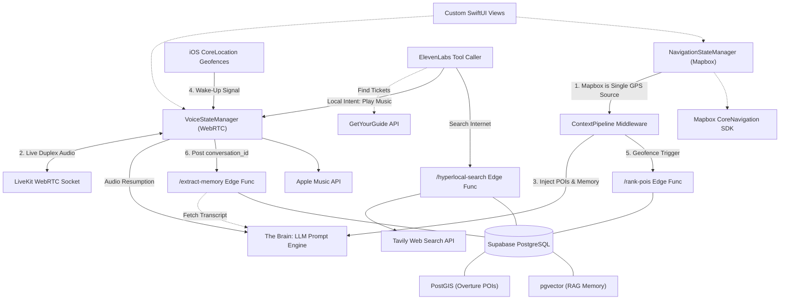

# RAAH AI: The Definitive Master Architecture Specification

**Document Purpose:** This is the absolute, unabridged Human-Readable Architecture Specification for the RAAH ecosystem. It exhaustively details the architecture, features, and sub-systems required to rebuild the app from scratch. It merges the critical UX loops of the current legacy app with the precise mathematical and network constraints defined across all 7 foundational documents in the `raah_current_plan`.

---

## 1. The Complete System Architecture Topography

To ensure maximum scalability and battery efficiency, the RAAH ecosystem completely rejects local processing. The iOS app acts merely as a "Sensory Nervous System" while all intelligence is deferred to the cloud.

### 1.1 The Master System Flowchart

### 1.2 The Single Point of Truth
*   **The Workflow:** `NavigationStateManager` pulls highly taxing routing coordinates once via Mapbox, managing the visual UI. It continuously feeds that exact passive coordinate into the `ContextPipeline` so no other system (e.g., Apple `CoreLocation`) spins up the GPS antenna, eliminating double-polling battery drain.
*   **The Business Value:** Unbreakable code stability and battery longevity. Engineers can deploy routing changes without ever touching the Voice logic.

---

## 2. Auto-Narration: Proactive Intelligence & Routing

### 2.1 AI-Native Routing (Turn-by-Turn Instruction Interception)
*   **The Feature:** Transforming robotic GPS into a human walking companion.
*   **How it works structurally:** Standard navigation apps use robotic TTS ("In 500 feet, turn left"). RAAH explicitly intercepts Mapbox's `SpokenInstruction` events before iOS can read them aloud. 
    *   The Mapbox routing data is injected silently into the ElevenLabs System Prompt via WebRTC alongside the local Overture POI data.
*   **The Output:** The ElevenLabs AI natively says: *"Take a left at the next light—by the way, I see you're passing that heritage museum right now."*

### 2.2 Micro-Context Sensory Panning (Directional Intelligence)
*   **The Feature:** Real-world orientation parity.
*   **How it works structurally:** `CLHeading` (Compass direction) and `CMMotionActivityManager` (Velocity: Walking vs Driving) are fed to ElevenLabs.
    *   *Compass:* If the user faces North, the AI says *"Look to your right, that glass building is the museum"* instead of absolute directions (*"Look East"*).
    *   *Spatial Audio:* Using native iOS `AVAudioEnvironmentNode` panning, the AI's physical voice will literally sound like it is coming from the right AirPod when pointing out the building.

### 2.3 Information Density & The Setup Bucket
*   **The Feature:** Pacing the AI so it doesn't annoy the user.
*   **How it works structurally:** Geofences will trigger constantly in a city. RAAH uses a **Token Bucket Rate Limiter**. If the AI speaks 3 times in 5 minutes, the bucket empties, and the AI is forced to stay totally silent even if the user passes the Eiffel Tower ("Golden Silence"). It measures total *word count density*, allowing the user to simply enjoy the city in peace after a long lecture.

---

## 3. The Navigation Engine (Zero Battery Drain)

### 3.1 Resolving the GPS Battery Death
*   **The Feature:** 24/7 proactive spatial awareness tracking.
*   **How it works structurally:** Active, continuous GPS polling is banned. RAAH employs the **19+1 Geofence Bounding Box Algorithm**.
    *   The app drops a massive 2-kilometer virtual circle around the user, permanently powers down active GPS polling, and goes to sleep.
    *   When the user physically crosses the 2km limit, iOS wakes the app. The app hits Supabase for new Overture POIs, drops a new 2km circle, registers 19 tiny 100m internal geofences, and sleeps again.
*   **The Business Value:** Passive spatial tracking that runs indefinitely in a user's pocket with near-zero idle battery loss.

### 3.2 Supabase Dynamic POI Scoring (The 9-Vector Math Model)
*   **The Feature:** The intelligence deciding *which* 19 POIs to fetch out of millions.
*   **How it works structurally:** The iOS app delegates this to the Supabase `/rank-pois` Edge Function, which runs a dynamic mathematical product model:
    1.  *Spatial Proximity* (Gaussian decay curve).
    2.  *Personalization* (Multipliers aligned to user vectors).
    3.  *Temporal Context* (Boosting sunrise lookouts at 6 AM).
    4.  *Global Quality* (Foursquare density ranking).
    5.  *User Velocity* (Ignore small statues if driving 30mph).
    6.  *Weather* (Penalizing open-air parks during heavy rain).
    7.  *Conversation Intent* (Dynamically boosting historical sites if user asked about history).
    8.  *Semantic Fit* (`pgvector` Cosine matches on amenity tags).
    9.  *Recency Fatigue:* **Crucial.** If the AI narrated a museum 5 minutes ago, the weight of all other museums instantly drops to `0.2` for twenty minutes.

---

## 4. WebRTC Voice Engine & Background Resumption

### 4.1 Telephony Handover Resilience
*   **The Feature:** Sub-300ms audio latency that survives the real world.
*   **How it works structurally:** We use the official **LiveKit Swift SDK**. LiveKit manages a persistent `Room` that handles IP network handovers invisibly (WiFi -> Cellular). If total signal loss occurs (e.g., subway tunnel), the app gracefully degrades, playing a local offline `.mp3` cache (`"Losing your signal, give me a sec..."`) to mask the dropout.

### 4.2 Background Audio Resumption (The Holy Grail)
*   **The Feature:** The AI speaks to the user proactively while the phone is locked.
*   **How it works structurally:** The `AudioSessionManager` permanently locks the iOS `AVAudioSession` onto `.playAndRecord` and `.voiceChat` with `.allowBluetooth`.
    *   The user crosses a 100m POI Geofence. iOS fires `didEnterRegion(region)`.
    *   The app uses its background execution time to aggressively reclaim audio priority (`.setActive(true)`).
    *   It silently transmits a JSON Client Event to ElevenLabs over LiveKit: *"User is at the Museum. Narrate it."*
    *   The ElevenLabs LLM processes the prompt and streams TTS instantly into the user's AirPods without the user touching the screen.

---

## 5. Hyperlocal Web Search & Agency

### 5.1 Resolving the Search Freeze
*   **The Feature:** Agency to answer highly specific internet questions instantly.
*   **How it works structurally:** We use **ElevenLabs Client Tool Calling** as a mediator.
    *   The AI triggers `search_hyperlocal_internet(query)`.
    *   The JSON payload flows down the WebRTC socket. The iPhone catches it, pauses the microphone, and routes an HTTP POST straight to the Supabase `/hyperlocal-search` Edge Function.
    *   Supabase pings the **Tavily API**, accesses Reddit/local forums, strips out the raw HTML code, generates highly compressed Markdown, and returns it to the iPhone in ~1.5 seconds.
    *   The iPhone natively pushes the Markdown back up the WebRTC socket to ElevenLabs, who synthesizes the final answer.

---

## 6. Long-Term RAG Memory Integration

### 6.1 The Unified pgvector Engine
*   **The Feature:** Infinite memory context across sessions.
*   **How it works structurally:** To prevent double infrastructure costs (Qdrant + Postgres), we strictly utilize Supabase PostgreSQL (`PostGIS` for map POIs, `pgvector` for user memories).
    *   When the user ends a call, the iOS app POSTs the `conversation_id` to the Supabase `/extract-memory` Edge Function.
    *   Supabase uses elevated backend admin privileges to query the ElevenLabs REST API, downloading the full session transcript.
    *   It runs the transcript through `gpt-4o-mini` to extract factual chunks ("User is allergic to peanuts"), appends a Freshness Timestamp (for Recency Decay scoring), and embeds the vectors natively.
*   **Retrieval:** During live conversations, ElevenLabs uses a Tool Call (`search_user_memory()`) to dynamically query Supabase using Cosine Similarity matching when the user mentions their dietary restrictions.

---

## 7. Spatial UI, Biometrics, and SOS Safety

### 7.1 The Liquid Glass Aesthetic & Orb Binding
*   **The Feature:** Distraction-free OLED spatial design.
*   **How it works structurally:** The 3D `Mapbox NavigationMapView` is locked to the absolute bottom (`ZIndex 0`). Top elements (Orb, Navigation Bar) utilize Apple's `.ultraThinMaterial` (Liquid Glass background blurring) and `allowsHitTesting(false)` so the user can pan the map *through* them.
*   **The AI Orb:** Static SwiftUI animation loops are strictly banned. The Orb's `scaleEffect`, `glowRadius`, and `ringPhase` are mathematically bound down to the millisecond to the `LiveKit.audioLevelPublisher`. When the AI takes a breath, the visual orb organically shrinks at 60fps.

### 7.2 Safety & The Walk-Me-Home Protocol
*   **The Feature:** A decoupled panic/safety engine.
*   **How it works structurally:** Safety cannot rely on AI uptime. The `SafetyStateManager` oversees a background countdown timer natively in iOS. If the timer expires—or if the user manually executes the Triple-Tap SOS gesture on the Orb:
    *   The manager bypasses ElevenLabs completely.
    *   It grabs the native Mapbox GPS coordinates.
    *   It forces the local iPhone microphone active to silently record ambient audio.
    *   It pushes the exact coordinates and `.m4a` file directly via HTTP POST to the Supabase disaster recovery routing table.
