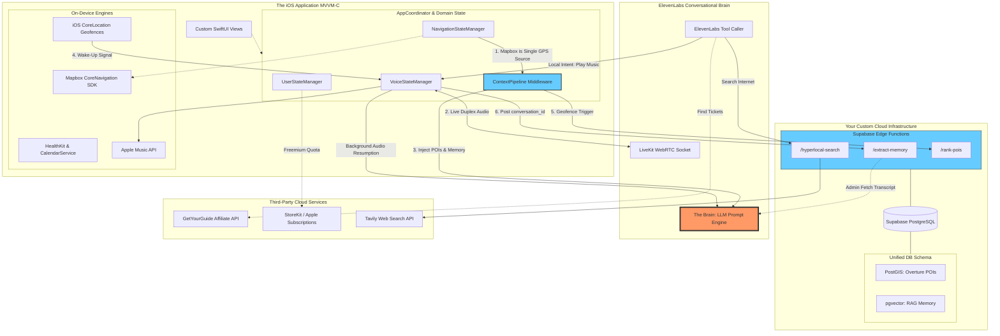

# Master System Architecture: The Verified RAAH Blueprint

*(This document supersedes all previous drafts and maps **exactly** to the explicit technologies, libraries, and design patterns agreed upon across the Implementation Plan, Navigation Plan, Auto-Narration Plan, AppState Refactoring Plan, and Web Search Plan, integrating all Discrepancy Fixes).*

## 1. The Core Paradigm: MVVM-C to ElevenLabs WebRTC
RAAH uses a highly robust iOS client utilizing **Actor-Isolated MVVM-C Domain-Driven Design**. It manages complex local sensors (ARKit Cameras, Geofencing, Calendar, Mapbox) and continuously feeds that context into a **Duplex LiveKit WebRTC** connection powered by the **ElevenLabs Conversational AI**.

ElevenLabs acts as the absolute brain: handling STT (listening), LLM (thinking Tool Calling), and TTS (talking). The iOS app acts as the sensory nervous system. Local LLM models are explicitly rejected in favor of graceful offline degradation.

## 2. The Comprehensive Flowchart

### Explaining the Flowchart: The Data Pipeline
To understand why this topology represents the ultimate state of efficiency, follow the data:

1. **The Single Point of GPS Truth:** `NavigationStateManager` pulls incredibly taxing mapping coordinates once via Mapbox, managing visual UI updates. It concurrently streams those passive coordinates into the `ContextPipeline` middleware so that no other engine queries the hardware GPS antenna, eliminating dual-polling battery drain.
2. **The "Sentient" Inputs:** The App feeds live Duplex Audio (user speech) and Video Tracks (ARKit Camera natively via LiveKit) out to the ElevenLabs Socket with sub-300ms latency. Meanwhile, iOS `CoreLocation` geofences sleep passively in the background until the user crosses them. When triggered, they signal `VoiceStateManager` to aggressively wake a suspended audio session and push an invisible prompting command to the LLM without requiring screen interaction.
3. **The Backend Heavy Lifting:** The iOS app **never** performs heavy extraction, inference, or scraping. Instead, it uses Supabase Edge Functions. When a voice session closes, the phone merely tells Supabase the ID; Supabase then privately fetches the transcript from the ElevenLabs API, embeds variables via RAG `pgvector`, and manages long-term memory entirely on the server.
4. **Tool Calling Agency:** By giving ElevenLabs a robust Tool Schema, the AI has true agency. If it needs web knowledge, it natively triggers a cloud-based Edge Function (Tavily) to scrape Reddit safely. If it needs to execute an OS command, it bounces an intent backwards to the iPhone's `VoiceStateManager` to physically take action (e.g., launching Apple Music locally).

## 3. Subsystem Traceability (The Objective Truth)

1. **Navigation & Mapping:** The app uses **Mapbox CoreNavigation SDK** to map a custom UI instead of Apple MapKit or Google Places. Overture open-source Places are self-hosted in **Supabase PostGIS**.
2. **Dual-GPS Prevention:** **Mapbox (`NavigationStateManager`) acts as the absolute Single Source of Truth for GPS coordinates**. It explicitly pipes its location feed into `ContextPipeline` so that the app doesn't suffer battery drain from rogue secondary `CLLocationManagers`.
3. **Auto-Narration Engine & Wake-Up:** The app utilizes low-power **iOS CoreLocation Geofences** which ping the `/rank-pois` Supabase Edge Function to evaluate the **9-Vector Math Formula**. If the phone is asleep when the Geofence exits, `VoiceStateManager` claims `AVAudioSession` priority and uses ElevenLabs' System Prompt Injection to violently wake up the AI and speak the narration out loud. 
4. **No 'Snap and Ask' Vision:** The legacy "Snap and Ask" feature (handled by `OpenAIVisionService.swift`) has been completely removed from the MVP. The AI maintains pure audio conversational processing via WebRTC to eliminate the risk of `AVCaptureSession` background crashes while the phone is in the user's pocket. Do not pipe ARKit frames to LiveKit.
5. **Long-Term Memory RAG:** All transcripts are fetched server-side. When the LiveKit session terminates, the iOS app only posts the `conversation_id` to the `/extract-memory` Edge Function. The cloud hits the ElevenLabs Admin API to fetch the text, avoiding the Impossible Loop of iOS trying to upload a streaming binary transcript it never had.
6. **Web Search & Tool Calling Agency:** The App has true agency. Heavy web interactions like internet scraping use **Tavily APIs** hidden entirely behind the `/hyperlocal-search` Supabase Edge Function to protect iOS keys and maintain 1.5s latency. Inversely, ElevenLabs uses Tool Calling to fire intents natively back into the iOS App to trigger local APIs like **Apple Music**.
7. **App State De-Spaghettification:** The 1,168-line God Class is permanently fractured into `VoiceStateManager`, `NavigationStateManager`, and `UserStateManager`, explicitly orchestrated by an `AppCoordinator`.
